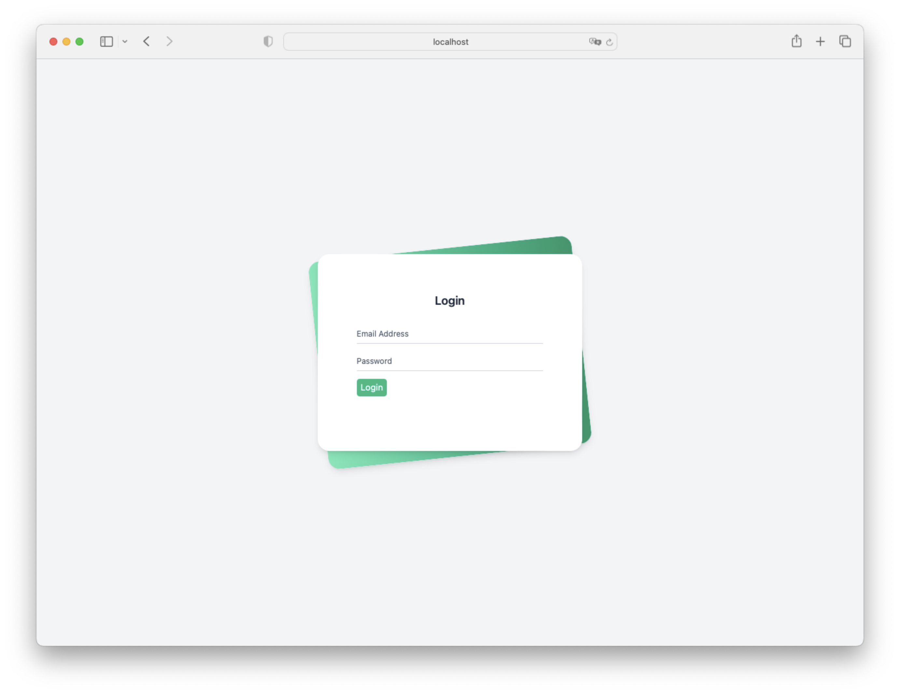
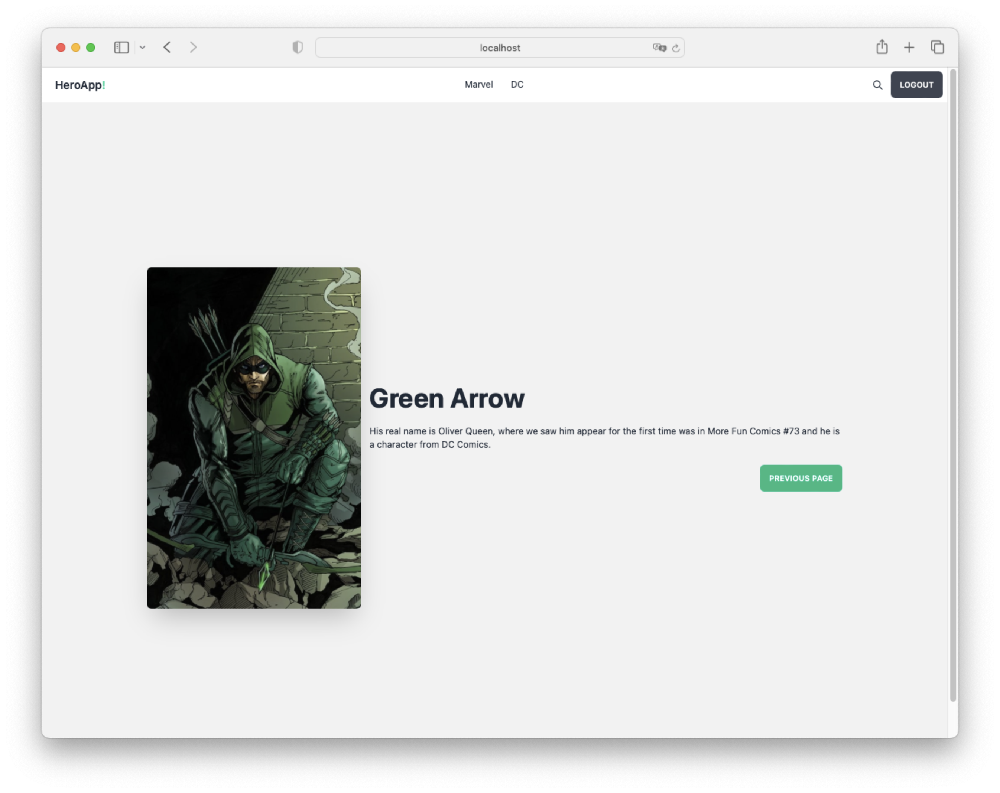
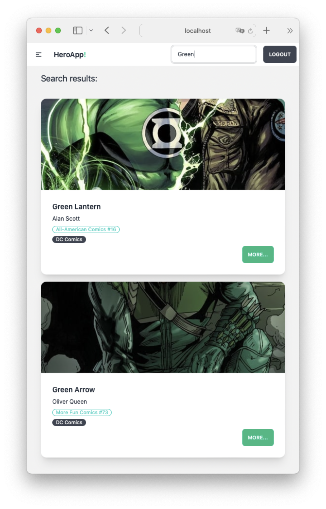

# HeroApp

HeroApp is a small frontend application built with React that allows users to explore and discover information about their favorite superheroes. Users can search for superheroes by name, view details such as their biography, abilities and powers, and bookmark their favorite characters. With a simple and attractive user interface, HeroApp is perfect for superhero fans who want quick and easy information about their favorite characters.

By clicking the "Login" button, users are redirected to an attractive and easy-to-use login page. Here they can enter their access credentials, such as their username and password, in clearly labeled and secure fields.

The HeroApp homepage features a clean, minimalist design, with an intuitive interface that allows users to search and discover information about their favorite superheroes. The main focus of the page is a prominent search field at the top, where users can enter the name of the superhero they want to search for.

The superhero details page on HeroApp offers an immersive and minimalist experience for superhero fans. The page presents an attractive and visually pleasing interface, with a striking image of the superhero, along with his name and a short biography.

On the main page of HeroApp, users can find a prominent search bar at the top of the interface. This search bar allows them to enter the name or part of the name of the superhero they want to search for.
Users can click on one of the search results to access the details page for the corresponding superhero. On the details page, the detailed information of the wanted superhero is displayed, as described above.

